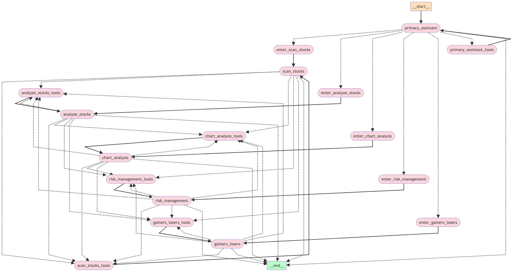

# financial-chat

A financial chat application powered by [LangChain](https://www.langchain.com/), [LangGraph](https://langchain-ai.github.io/langgraph), [OpenBB](https://openbb.co/products/platform), [Claude 3 Opus](https://www.anthropic.com/claude), and [Streamlit](https://streamlit.io).

## Blog Articles

If you're curious about the journey of building this project, check out these blog articles:

- [Building an Agentic Stock Analysis Tool with LangChain, OpenBB, and Claude 3 Opus](https://sethhobson.com/2024/03/building-an-agentic-stock-analysis-tool-with-langchain-openbb-and-claude-3-opus)
- [Expanding the AI Stock Analysis Agent with Fundamental and Technical Tools](https://sethhobson.com/2024/04/expanding-the-ai-stock-analysis-agent-with-fundamental-and-technical-tools)
- [Improving the Edge: Trendlines, Sectors, and Sentiment](https://sethhobson.com/2024/04/improving-the-edge-trendlines-sectors-and-sentiment)
- [Unlocking Alpha: Harnessing Relative Strength for AI-Driven Stock Selection](https://sethhobson.com/2024/04/unlocking-alpha-harnessing-relative-strength-for-ai-driven-stock-selection)
- [Seeing the Bigger Picture: Adding Chart-Based Technical Analysis](https://sethhobson.com/2024/04/seeing-the-bigger-picture-adding-chart-based-technical-analysis)
- [Empowering the AI Stock Analysis Agent with Universe Scanning](https://sethhobson.com/2024/04/empowering-the-ai-stock-analysis-agent-with-universe-scanning)
- [Risk Management in AI Stock Trading: A Key to Success](https://sethhobson.com/2024/05/risk-management-in-ai-stock-trading-a-key-to-success)
- [Converting the AI Stock AgentExecutor to LangGraph](https://sethhobson.com/2024/05/converting-ai-stock-agentexecutor-to-langgraph)
- [Unleashing the Power of Multiple Agents with LangGraph](https://sethhobson.com/2024/05/unleashing-the-power-of-multiple-agents-with-langgraph)
- [Deploying the AI Stock Analysis Agent on AWS with Copilot](https://sethhobson.com/2024/06/deploying-the-ai-stock-analysis-agent-on-aws-with-copilot)

## Features

- Fetches financial data using OpenBB
- Generates technical analysis summaries using AI
- Provides stock price history, quantitative stats, and more
- Calculates relative strength for stocks
- Sentiment analysis on news articles
- Universe scanning using FinViz filters
- Risk management techniques using technically-derived stops and R Multiples
- Interactive Streamlit UI for chat-based interaction
- Multiple Agent Workflows using LangGraph
- Deployment to AWS with the Copilot CLI

## Installation

1. Install the required dependencies using Poetry:

```bash
poetry install
```

2. Set up the necessary environment variables. You can create an `.env` at the project root for these:

```bash
export OPENAI_API_KEY=<your-api-key>
export OPENBB_TOKEN=<your-openbb-token>
export TIINGO_API_KEY=<your-tiingo-api-key>
export IMGUR_CLIENT_ID=<your-imgur-client-id>
export IMGUR_CLIENT_SECRET=<your-imgur-client-secret>
export FMP_API_KEY=<fmp-api-key>
export INTRINIO_API_KEY=<intrinio-api-key>
```

## Usage

### Streamlit UI

Run the Streamlit app:

```bash
streamlit run app/ui.py
```

### FastAPI Server

Start the FastAPI server:

```bash
uvicorn app.server:app --host 0.0.0.0 --port 8080
```

You can view the [Swagger Docs](http://0.0.0.0:8080/docs) and test out the [Playground](http://0.0.0.0:8080/chat/playground), courtesy of [LangServe](https://python.langchain.com/v0.2/docs/langserve).

## Docker

Build the Docker image:

```bash
docker build -t financial-chat .
```

Run the Docker container:

```bash
docker run -p 8080:8080 --env-file .env financial-chat
```

## Project Structure

- `app/`: Main application code
  - `chains/`: LangChain agent and prompts
  - `features/`: Feature-specific code (technical analysis, charting)
  - `tools/`: Custom tools for data retrieval and analysis
  - `ui.py`: Streamlit UI
  - `server.py`: FastAPI server
- `Dockerfile`: Dockerfile for building the application
- `pyproject.toml`: Project dependencies and configuration
- `README.md`: Project documentation

## Flowchart


